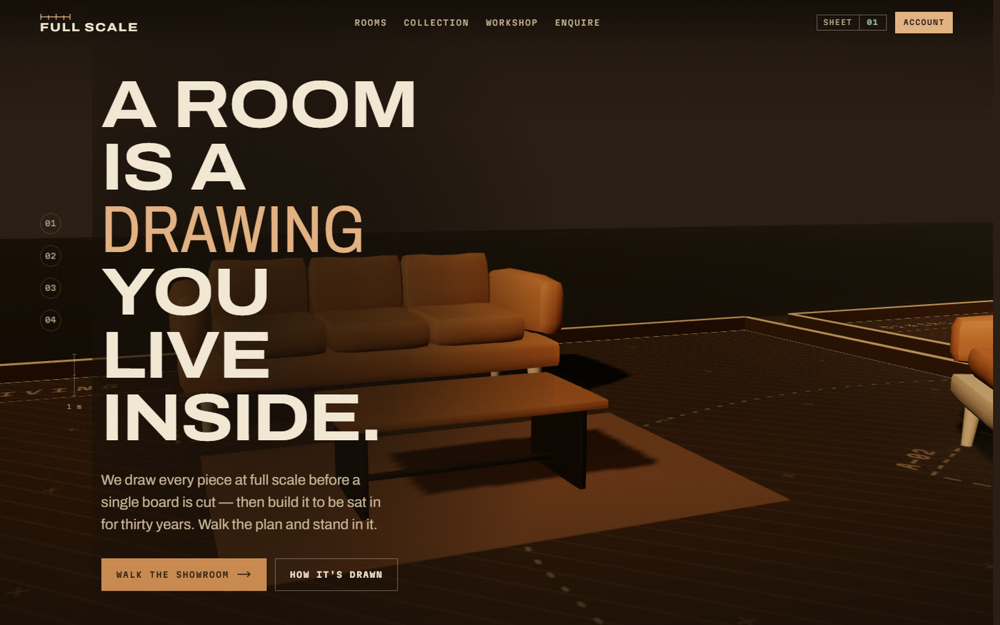
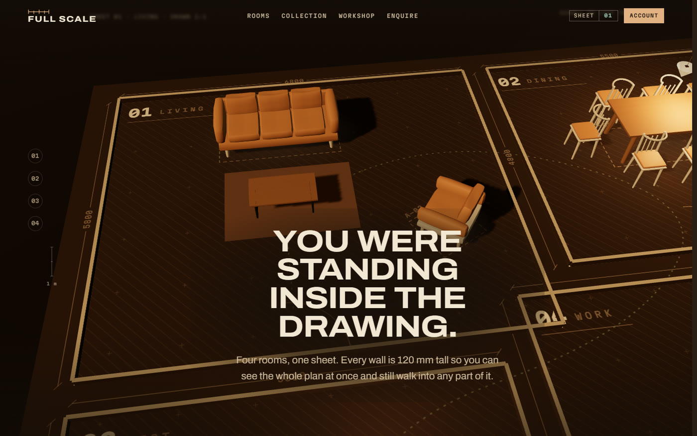
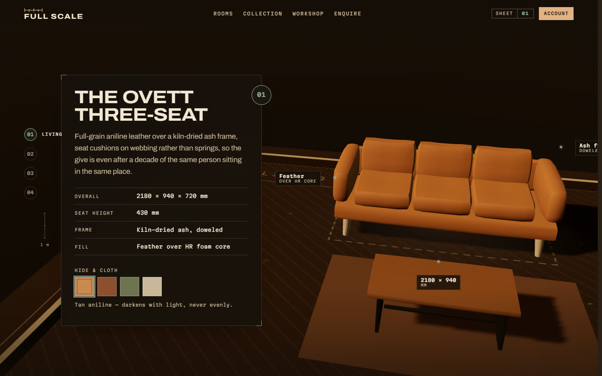
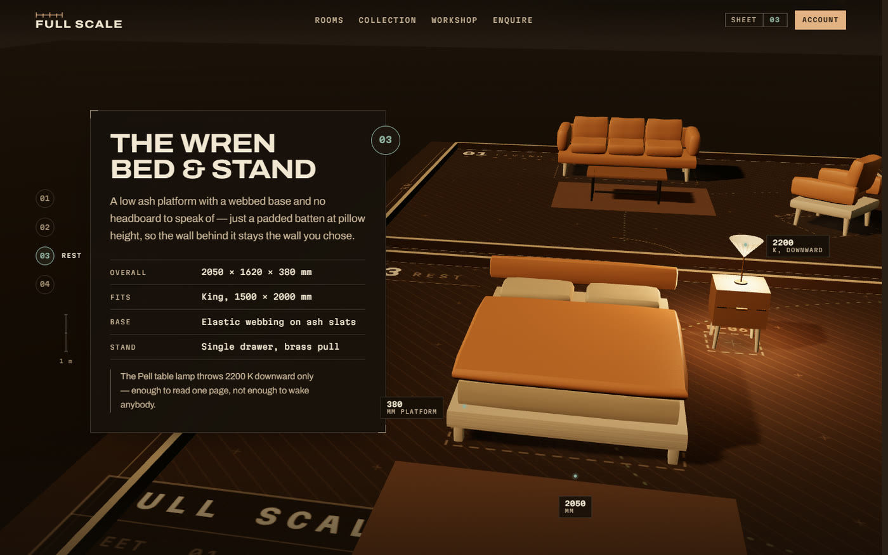
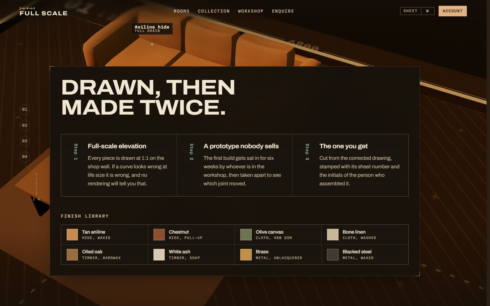
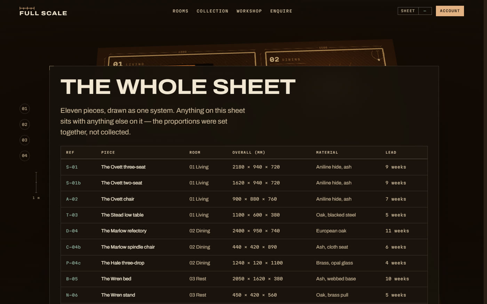
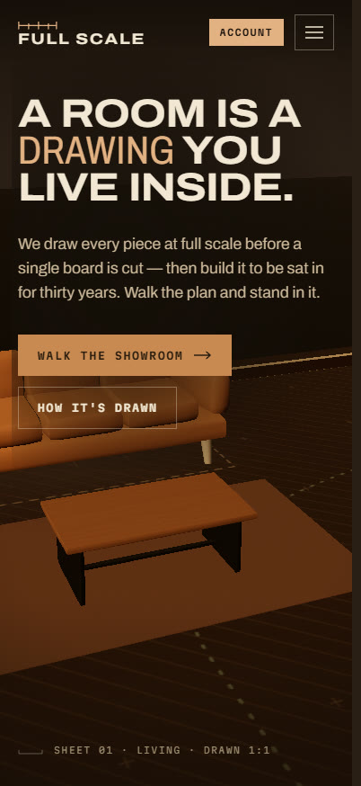
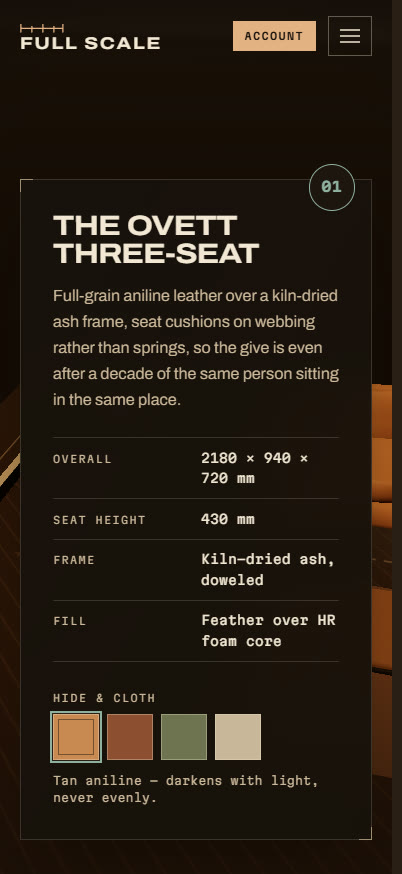

<div align="center">

# Full Scale

### A room is a *drawing* you live inside.

A furniture landing page built as an architect's furnished floor plan — one you
walk rather than scroll past.

[**View it live →**](https://wasiqtanveer.github.io/FullScale-Showroom/)

</div>



> [!WARNING]
> **This is a design mock, not a launch.** The brand name, the copy, the piece
> names and every figure on the page are invented placeholders. There are
> deliberately **no prices, testimonials, customer names, press logos or
> addresses** anywhere in it — see the notice at the top of
> [`src/content.js`](src/content.js) and the constraints in
> [`PRODUCT.md`](PRODUCT.md). All of it must be replaced with real, verified
> content before this is shown publicly.

---

## The idea

Every furniture site ships the same first viewport: a full-bleed sofa over
cream, with a thin serif headline. Both of the reference images this started
from did exactly that.

This one refuses it. The surface is a **diazo sepia print** — umber ground, bone
linework, hatched floor fills, dimension strings, numbered station markers. You
begin at eye level *inside* Room 01, and the furniture is the only warm-lit
thing on the sheet. The argument the page is making is that these pieces are
drawn and dimensioned before they are built, and that this discipline is why
they last.

There is exactly one motion idea: **a camera walking a plan**, with the
drawing's annotations catching up to it. Nothing else on the page has an
entrance of its own.



<em>Scroll lifts you off the floor and the whole sheet resolves — four rooms
drawn as one system, every wall 120 mm tall so the plan reads at a glance and
can still be walked into.</em>

---

## Walking it

Nine camera stations, each one a stretch of scroll. The camera arrives before
the copy panel is readable and then holds for as long as you are reading it.

| | |
|:--:|:--:|
|  |  |
| **01 Living** — the copy panel sits opposite the furniture, never over it | **03 Rest** — a single lamp pool is the only warm light in the room |
|  |  |
| **Workshop** — swatches drive the real mesh material, not a picture of it | **The whole sheet** — the collection as a drawing schedule, with refs and lead times |

Every piece of furniture is **generated in code** — a rounded-cube vertex
projection for the frames, sagging cushions, tapered legs, painted radial
contact shadows. Every texture is **drawn to a canvas at runtime**, including
the 2072 × 1924 plan itself, with its metre ticks, door swings, dimension
strings and titleblock. There are no 3D model files and no image assets in this
repository, which is why there are none to download.

---

## The opening beat

WebGL needs a moment before it can be looked at: Three.js parsing, the plan
texture being drawn, the scene assembling, and — the part that actually
stutters — the GPU compiling shaders on first render.

So the loader is **the sheet drawing itself**. The four rooms stroke in as bone
linework over a dimension string, with the current stage at one end and the
figure at the other.

Three rules it keeps:

**Progress is measured, not performed.** Every step is a real milestone. No
timer imitating a download.

**The label is derived from the figure on screen, never the milestone.** On a
warm load every milestone fires inside 100 ms while the eased figure is still
at 18 — and a loader reading "Ready" beside "18%" is what makes a progress
indicator feel invented.

**It leaves by handing over, not uncovering.** Its ground is the page's own
background colour, so there is no seam to hide: the drawing comes off, then the
ground dissolves in place while the first viewport lights and animates up
through it.

A visitor can **never** get stuck behind it — a failsafe, an error path, a
no-WebGL path and a catch around boot each dismiss it independently.

---

## On a phone

Portrait pulls the camera back and lifts it, because the framing that works in
landscape puts the furniture behind the copy.

| | |
|:--:|:--:|
|  |  |

---

## Running it

```bash
npm ci        # restore exact dependency versions
npm run dev   # dev server on 127.0.0.1:5180
npm run build # production build into dist/
npm run preview
```

Needs a browser with WebGL — but the page is fully readable without one. If the
context fails it falls back to the flat sheet rather than breaking.

---

## What's where

| Path | What's in it |
| --- | --- |
| [`index.html`](index.html) | The document, the direction contract as the first body comment, and the preloader's inline styles |
| [`src/main.js`](src/main.js) | Boot sequence, preloader wiring, swatches, nav drawer, form |
| [`src/scene/`](src/scene/) | Camera stations, procedural furniture geometry, materials, and the plan drawn to a canvas texture |
| [`src/motion.js`](src/motion.js) | Scroll-driven camera, reveals, station tracking, smooth scroll |
| [`src/annotate.js`](src/annotate.js) | Projecting DOM labels from 3D positions, with keep-out zones |
| [`src/preloader.js`](src/preloader.js) | The opening beat and its hand-off to the page |
| [`DESIGN.md`](DESIGN.md) | The design system, derived from the shipped code |
| [`.impeccable/`](.impeccable/) | Playwright probes used to verify the build |

---

## Weight

Warm and cozy was the brief; heavy was not. The payload is code rather than
assets, and Three.js is the floor.

| Chunk | Gzip |
| --- | --- |
| `three` | 132 kB |
| `motion` (GSAP + Lenis) | 50 kB |
| Page code | 13 kB |
| CSS | 7 kB |

One shadow map. Contact shadows painted rather than cast. Device pixel ratio
capped at 1.4 on mobile and 1.75 on desktop. Shaders pre-compiled before the
loader lifts, so the first scroll doesn't land on a compile stall. Rendering
**halts entirely** when the tab is hidden.

---

## Accessibility

Not retrofitted. `prefers-reduced-motion` disables the smooth scroll, the
reveals and the loader's animation while keeping every word. The finish
selector is a real radiogroup with arrow-key navigation. The form reports
errors with `aria-invalid` and a live region. There's a skip link, every figure
is set in tabular numerals, and the whole page reads without WebGL.

---

## Design notes

[`DESIGN.md`](DESIGN.md) is derived from the shipped code rather than from
intentions. It carries the palette, the type ramp, the motion tokens, and a set
of named rules — *The Only Lit Thing*, *Green Means Now*, *Mono Is Earned Not
Worn*, *Furniture Opposite Its Copy*.

Each "don't" in it records an actual defect that produced it. A few, for
flavour:

- Don't use `ScrollTrigger` to reveal a `position: sticky` element — its start
  measurement is unreliable there, which left whole panels at `opacity: 0`.
- Don't animate `filter: blur()` on entrance. At 7px on a display-scale
  headline it pushed the first animated frame of the loader's hand-off from
  631 ms to 1710 ms.
- Don't pin a table header inside a horizontal scroller. The wrapper becomes
  the scrollport, so the header sticks to *it* and parks across row two.
- Don't lock scroll without `scrollbar-gutter: stable`, or the whole first
  viewport slides sideways at the moment it's being looked at.

---

<div align="center">
<sub>Built with Vite, Three.js, GSAP and Lenis. Furniture drawn in code.</sub><br />
<sub><em>Screenshots are software-rendered (SwiftShader) and are a little duller
than the page on a real GPU.</em></sub>
</div>
